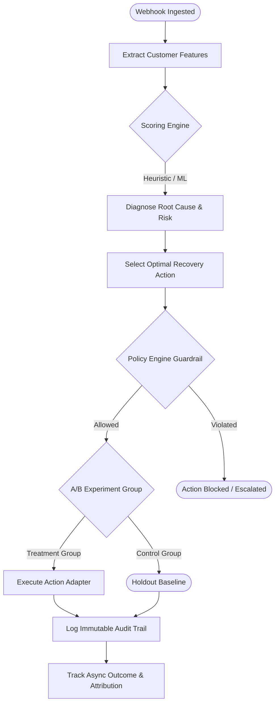

# RecoverFlow Architecture & Engineering Reference

RecoverFlow is an autonomous, agent-orchestrated payment failure recovery platform designed to maximize merchant revenue through intelligent interventions, deterministic A/B experimentation, and mathematical incremental attribution.

---

## 1. System Architecture

```text
                               ┌────────────────────────────────────────────────────────┐
                               │                 Merchant & Customer Web                │
                               └──────────────────────────┬─────────────────────────────┘
                                                          │ (Failed / Succeeded Payment)
                                                          ▼
┌────────────────────────────────────────────────────────────────────────────────────────────────────────┐
│                                       INGESTION & STREAMING LAYER                                      │
│                                                                                                        │
│  [ Webhook Receiver ] ──(HMAC-SHA256)──► [ Redis Stream: recoverflow_events ] ──► [ Decoupled Bus ]    │
│           │                                                                                            │
│           ▼                                                                                            │
│  [ Celery Task Queue ] ────────────────► [ Normalizer: UnifiedEvent ] ──► [ Opportunity Engine ]       │
└─────────────────────────────────────────────────────┬──────────────────────────────────────────────────┘
                                                      │
                                                      ▼
┌────────────────────────────────────────────────────────────────────────────────────────────────────────┐
│                                   INTELLIGENCE & ORCHESTRATION LAYER                                   │
│                                                                                                        │
│  [ Customer Profile Builder ] ──► [ Heuristic / ML Scoring ] ──► [ LangGraph Recovery Orchestrator ]   │
│                                                                                  │                     │
│                                                                                  ▼                     │
│                                                                      [ Policy Engine Guardrails ]       │
└─────────────────────────────────────────────────────┬──────────────────────────────────────────────────┘
                                                      │
                                                      ▼
┌────────────────────────────────────────────────────────────────────────────────────────────────────────┐
│                                       ACTION & EXPERIMENTATION LAYER                                   │
│                                                                                                        │
│  [ Deterministic A/B Assignment ] ──► [ Action Adapters (Payment Link / Email / Human Escalation) ]    │
│                                                      │                                                 │
│                                                      ▼                                                 │
│  [ Learning Loop & Attribution ] ◄── [ Outcome Tracking & Immutable Evidence Audit Trail ]             │
└─────────────────────────────────────────────────────┬──────────────────────────────────────────────────┘
                                                      │
                                                      ▼
┌────────────────────────────────────────────────────────────────────────────────────────────────────────┐
│                                     OPERATIONS & PRESENTATION LAYER                                    │
│                                                                                                        │
│  [ Next.js 14 Dashboard (SSE Real-Time) ] ◄──► [ Prometheus & Grafana ] ◄──► [ Kubernetes Cluster ]   │
└────────────────────────────────────────────────────────────────────────────────────────────────────────┘
```

---

## 2. Multi-Agent LangGraph State Machine



---

## 3. Mathematical Foundations

### 3.1 Expected Recovery Value
\[
\text{Expected Recovery} = \text{Recoverability Score} \times \text{Amount At Risk}
\]

### 3.2 Statistical Lift in A/B Experimentation
\[
\text{Lift} = \text{Recovery Rate}_{\text{treatment}} - \text{Recovery Rate}_{\text{control}}
\]
\[
\text{Relative Lift (\%)} = \left( \frac{\text{Recovery Rate}_{\text{treatment}} - \text{Recovery Rate}_{\text{control}}}{\text{Recovery Rate}_{\text{control}}} \right) \times 100
\]

### 3.3 Incremental Revenue Attribution
\[
\text{Incremental Recovered Amount} = \text{Treated Volume} \times (\text{Rate}_{\text{treatment}} - \text{Rate}_{\text{control}}) \times \bar{A}
\]
where $\bar{A}$ is the average opportunity transaction value.
